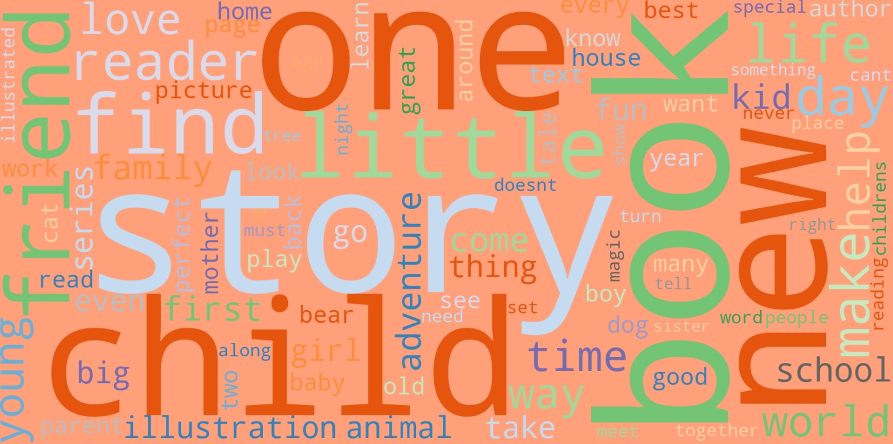
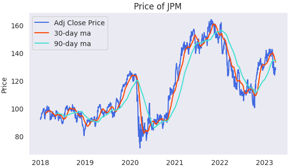
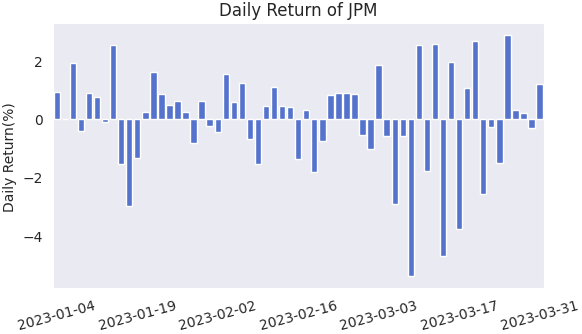

## Selected projects in data science, machine learning, NLP and neural network

---

### Recommender systems making use of both content-based filtering and collaborative filtering, NLP on text data

### [Children's Book Recommendation APP](https://sh-children-book-recommend.streamlit.app/)

A children’s book recommendation mini-APP aims to help children improve English literacy. **Recommender systems** include content-based filtering, item-item collaborative filtering and Matrix Factorization models. **NLP**(Natural Language Processing) and other Machine Learning techniques applied.

 

     

[Read more](/book_recommend) 

[View code on GitHub](https://github.com/sl-huo/book-recommend)

---

### Detecting fradulent e-commerce payment through predictive modelling: XGBoost and LGBM

Applying machine learning models on e-commerce transactions dataset, which contains a wide range of features from device type to product features, to detect fraudulent transactions and improve the efficacy of alerts to reduce losses from fraud.

<!--  -->

 

      

[Read more](/fraud_detection)

[View code on GitHub](https://github.com/sl-huo/payment-fraud-detection)

---

### Forecasting megabank stock price through time series analysis & LSTM

Time series analysis for megabank stocks in the past 20 years, comparing stock price trend, seasonality, and return; predicting stock price using LSTM.

 

     

[Read more](/time_series)

[View code on GitHub](https://github.com/sl-huo/time-series-stock-forecast)

---

## Data Analysis & Visualizations

### London Cycling Analysis using Tableau
Analyzing cycling journey across London during summer (July & August) in 2022. 

 

[View workbook on GitHub](https://github.com/sl-huo/london-cycling)

---
<!-- --- -->

<!-- Remove above link if you don't want to attibute -->
