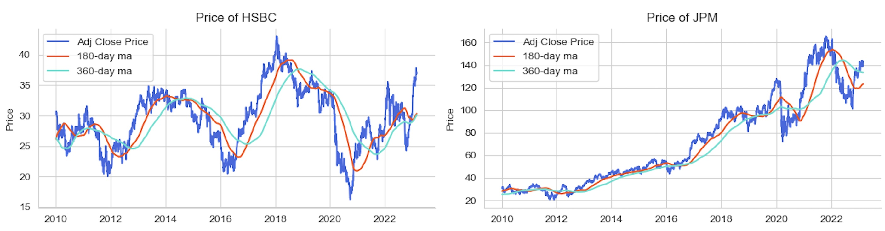
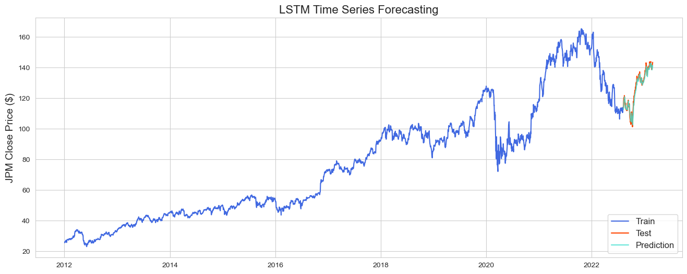

## Selected projects in data science, machine learning and NLP

---

### Building recommender systems based on book content and user review, using NLP on text data analysis

### [Children's Book Recommendation APP](https://sh-children-book-recommend.streamlit.app/)

A children’s book recommendation mini-APP to help improve English literacy. **Recommender systems** includes content-based filtering, item-item collaborative filtering and Matrix Factorization models. **NLP**(Natural Language Processing) and other Machine Learning techniques applied.

 

     

[Read more](/book_recommend) 

[View code on GitHub](https://github.com/sl-huo/book-recommend)

---

### Detecting fradulent e-commerce payment through predictive modelling, applied XGBoost and LGBM

Applying machine learning models on a the e-commerce transactions dataset, which contains a wide range of features from device type to product features, to detect fraudulent transactions and improve the efficacy of alerts to reduce fraud loss as well as save the hassle of false positives.

 

      

[Read more](/fraud_detection)

[View code on GitHub](https://github.com/sl-huo/payment-fraud-detection)

---

### Forecasting megabank stock price by applying time series analysis & LSTM

Time series analysis of megabank stock, including BAC, JPM, HSBC, RY... in the past 30 years, from 1993 till 2023.

     

---

<!-- --- -->

<!-- Remove above link if you don't want to attibute -->
